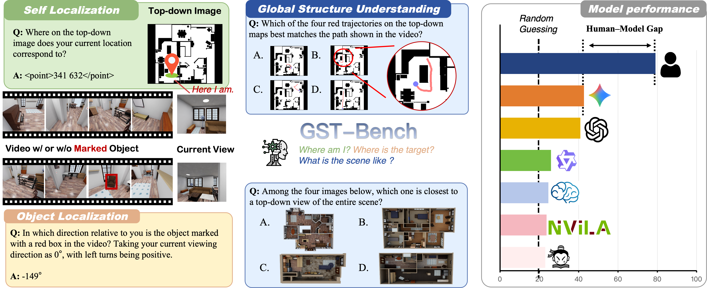

# GST-Bench

**GST-Bench: Can VLMs Develop Global Spatial Awareness from Video?**



## Environment setup

```bash
git clone https://github.com/qwerirwq/GST-Bench.git
cd GST-Bench
```

Dependencies may differ or conflict across model families. Please refer to the
official model links below and follow the corresponding installation
instructions to set up the environment for the model you want to evaluate.

## Model support

### Open-source models

This repository supports inference with the following open-source model
families. Before running inference, install the required dependencies by
following the setup instructions provided by each model's official repository
or model page.

- [Qwen3-VL](https://huggingface.co/Qwen/Qwen3-VL-8B-Instruct)
- [InternVL3.5](https://huggingface.co/OpenGVLab/InternVL3_5-8B)
- [LLaVA-NeXT-Video](https://huggingface.co/llava-hf/LLaVA-NeXT-Video-7B-hf)
- [LLaVA-OneVision 1.5](https://huggingface.co/lmms-lab/LLaVA-OneVision-1.5-8B-Instruct)
- [NVILA](https://github.com/NVlabs/VILA)
- [Cosmos-Reason2](https://huggingface.co/nvidia/Cosmos-Reason2-8B)
- [RoboBrain2.5](https://github.com/FlagOpen/RoboBrain2.5)

### API-based models

The repository also provides input formatters and inference-engine stubs for
the following proprietary models. Before evaluating these models, obtain the
corresponding API access and credentials, then implement the provider-specific
client initialization and request logic in `model_engines/`.

- GPT-4o
- GPT-5
- Gemini 2.5 Pro
- Gemini 3
- Seed1.8

Robix-7B and Robix-32B are retained as evaluation options for reproducibility,
but their inference implementation is not included. Please contact the authors
to request the inference code.

## Run inference

### Download GST-Bench data

Download the benchmark data from the
[GST-Bench Hugging Face dataset repository](https://huggingface.co/datasets/qwerirwq/GST-Bench):

```bash
hf download qwerirwq/GST-Bench \
  --repo-type dataset \
  --local-dir <PATH_TO_GST_BENCH_DATA>
```

### Run all tasks

Run inference from the GST-Bench repository root:

```bash
python3 inference.py \
  --model_name Qwen/Qwen3-VL-8B-Instruct \
  --model_series Qwen3vl \
  --model_path ./checkpoints/Qwen3-VL-8B-Instruct-SFT \
  --eval_dir <PATH_TO_GST_BENCH_DATA> \
  --save_dir <PATH_TO_INFERENCE_OUTPUT>
```

The main arguments are:

| Argument | Description |
| --- | --- |
| `--model_name` | Selects the model and inference-engine implementation. |
| `--model_series` | Selects the matching model-specific input formatter. |
| `--model_path` | Optionally overrides the default checkpoint. For example, keep `--model_name Qwen/Qwen3-VL-8B-Instruct` and use this argument to evaluate an SFT checkpoint of Qwen3-VL-8B-Instruct. |
| `--eval_dir` | Path to the downloaded GST-Bench data: `<PATH_TO_GST_BENCH_DATA>`.  |
| `--save_dir` | Root directory for inference results: `<PATH_TO_INFERENCE_OUTPUT>`. |

Omit `--model_path` to load the checkpoint identified by `--model_name` from
the configured model cache. Use `--tasks` to run only selected tasks, and run
`python3 inference.py --help` to view all available options.

### Supported model arguments

Use one of the following `--model_name` and `--model_series` combinations:

| `--model_name` | `--model_series` |
| --- | --- |
| `Qwen/Qwen3-VL-2B-Instruct` | `Qwen3vl` |
| `Qwen/Qwen3-VL-4B-Instruct` | `Qwen3vl` |
| `Qwen/Qwen3-VL-8B-Instruct` | `Qwen3vl` |
| `Qwen/Qwen3-VL-32B-Instruct` | `Qwen3vl` |
| `OpenGVLab/InternVL3_5-2B` | `Internvl` |
| `OpenGVLab/InternVL3_5-4B` | `Internvl` |
| `OpenGVLab/InternVL3_5-8B` | `Internvl` |
| `OpenGVLab/InternVL3_5-38B` | `Internvl` |
| `llava-hf/LLaVA-NeXT-Video-7B-hf` | `LLaVA-NeXT-Video` |
| `lmms-lab/LLaVA-OneVision-1.5-4B-Instruct` | `LLaVA-OneVision` |
| `lmms-lab/LLaVA-OneVision-1.5-8B-Instruct` | `LLaVA-OneVision` |
| `Efficient-Large-Model/NVILA-8B` | `NVILA` |
| `Efficient-Large-Model/NVILA-15B` | `NVILA` |
| `Efficient-Large-Model/NVILA-8B-Video` | `NVILA` |
| `Efficient-Large-Model/NVILA-15B-Video` | `NVILA` |
| `Efficient-Large-Model/qwen2-1.5b-longvila-256f` | `NVILA` |
| `nvidia/Cosmos-Reason2-8B` | `Cosmos` |
| `nvidia/Cosmos-Reason2-2B` | `Cosmos` |
| `robobrain2.5` | `Qwen3vl` |
| `gpt4o` | `gpt4o` |
| `gpt5` | `gpt5` |
| `gemini_2_5_pro` | `gemini_2_5_pro` |
| `gemini3` | `gemini_2_5_pro` |
| `seed1_8` | `seed1_8` |
| `Robix_7B` | `Robix` |
| `Robix_32B` | `Robix` |

## Evaluate predictions

Taking `Qwen3-VL-8B-Instruct` as an example, pass the model name to
`--model_name` and set `--output_dir` to the directory containing that model's
task result files. If inference used `--save_dir <PATH_TO_INFERENCE_OUTPUT>`,
the corresponding evaluation directory is
`<PATH_TO_INFERENCE_OUTPUT>/Qwen3-VL-8B-Instruct/results`.

Run all task metrics from the GST-Bench repository root:

```bash
bash evaluation/evaluate.sh \
  --model_name Qwen3-VL-8B-Instruct \
  --output_dir <PATH_TO_INFERENCE_OUTPUT>/Qwen3-VL-8B-Instruct/results
```

`<PATH_TO_INFERENCE_OUTPUT>` is the same root directory passed to
`inference.py --save_dir`. The evaluation `--output_dir` must point to the
model's `results` directory within that output root.

To run one metric directly:

```bash
python3 evaluation/Object_Localization_Egocentric_Direction_visual.py \
  --model_name Qwen3-VL-8B-Instruct \
  --output_dir <PATH_TO_INFERENCE_OUTPUT>/Qwen3-VL-8B-Instruct/results
```

> **Note:** Model predictions may not strictly follow the answer format defined
> in the task instructions. For example, a prediction may include
> chain-of-thought content, explanatory text, or unrelated punctuation. Before
> running the evaluation scripts, we recommend using an LLM to extract and
> normalize the final answer stored in each `pred` field. Keep the answer
> semantics unchanged, and do not modify `gt` or other sample metadata.
